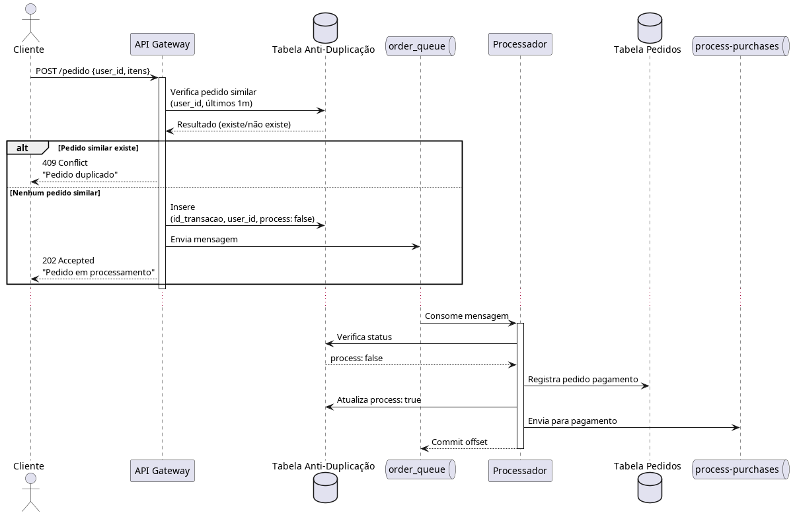

# idempotência queue

- Antes de entrar na fila, devemos garantir que cada pedido de pagamento seja único.
  - Uma estratégia seria colocar um time em cada pedido, assim checamos se existe um pedido de compra igual em um curto espaço de tempo para o mesmo usuário
- Já que vamos usar uma fila para background jobs, temos que garantir idempotência.
  - Antes de mandar o pedido de pagamento para o tópico de `process-purchases`, salvamos os IDs que forem entrar no tópico, assim vamos garantir que cada pedido de pagamento seja único.

**Exemplo**

{
"reference_id": "ex-00001",
"description": "Motivo da cobrança",
"amount": {
"value": 7171,
"currency": "BRL"
},
"payment_method": {
"type": "CREDIT_CARD",
"installments": 1,
"capture": false,
"card": {
"number": "4111111111111111",
"exp_month": "03",
"exp_year": "2026",
"security_code": "123",
"holder": {
"name": "Jose da Silva"
}
}
}
}

tabela pedido de pagamento
product_id: string
user_id: string
quantity : number
price: Float
card_number : string
card_exp_month : string
card_exp_year : string
card_security_code: string

req
product_id
user_id
quantity
"card": {
"amount": 100,
"number": "4111111111111111",
"exp_month": "03",
"exp_year": "2026",
"security_code": "123",
}
