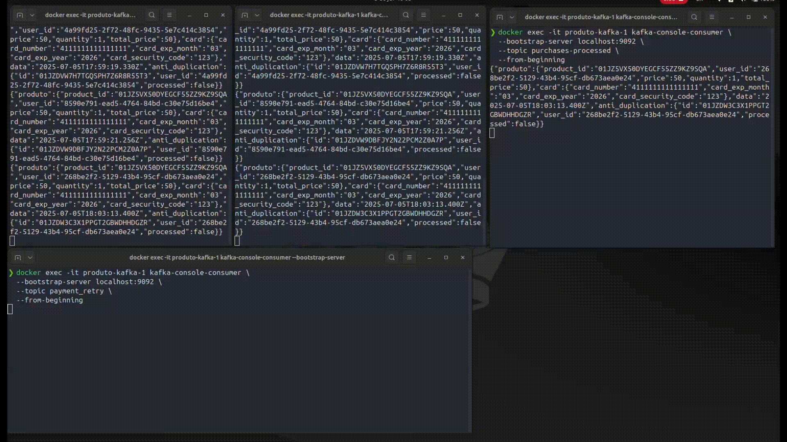
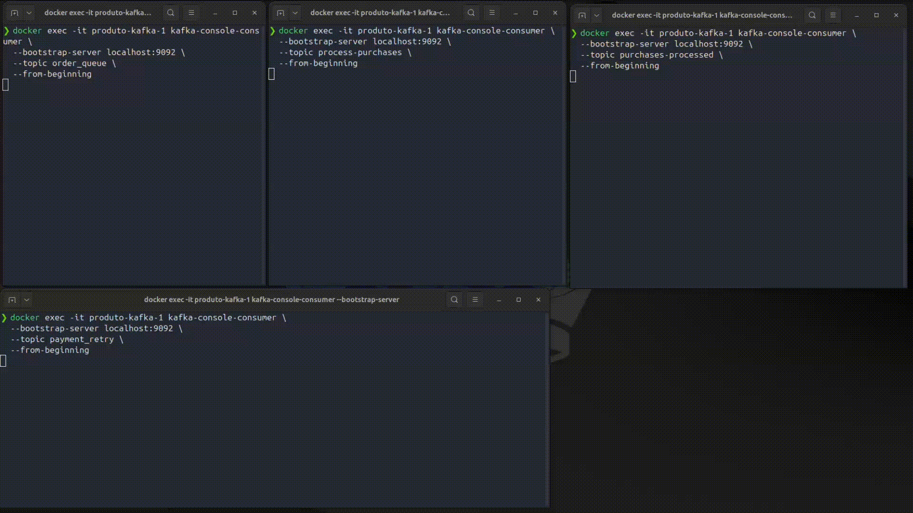
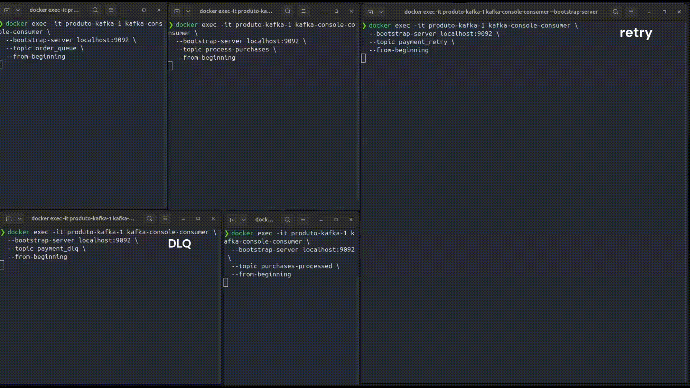

# Gateway Payment

Sistema de gateway de pagamentos distribuído, baseado em microsserviços, usei esse projeto para estudar implementação de Kafka e Kafka Connect. As APIs são POCs simples.

  
   
  <em>Fluxo de pagamento aprovado</em>

  
   
  <em>Fluxo de pagamento reprovado</em>

  
   
  <em>DLQ (Dead Letter Queue) em ação</em>

---

## Arquitetura

- **produto**: Gerencia produtos, reservas e estoque. Integra com MySQL, Elasticsearch e Kafka.
- **process-purchases**: Orquestra o fluxo de pedidos, controla duplicidade (idempotência), gerencia filas Kafka, retries e DLQ.
- **payment-processing**: Realiza o processamento final do pagamento.

O fluxo é totalmente assíncrono, desacoplado e resiliente a falhas, com shutdown gracioso e métricas de monitoramento.

### Diagrama de Fluxo

Veja o diagrama UML detalhado em [`process-purchases/docs/uml.plantuml`](process-purchases/docs/uml.plantuml).

---

## Tecnologias Utilizadas

- Node.js + TypeScript
- Express
- Prisma ORM (MySQL)
- Kafka (Debezium, Kafka Connect)
- Docker Compose
- Elasticsearch

---

## Como Executar

[arquivo com passo a passo](./executar_projeto.md)

---

## Fluxo de Processamento

1. **Recepção do Pedido**  
   O usuário faz um pedido de pagamento. O sistema verifica duplicidade (últimos 2 minutos) e insere na fila `order_queue` se for válido.

2. **Orquestração e Idempotência**  
   O serviço `process-purchases` consome a fila, garante idempotência via tabela de anti-duplicação e processa o pedido.

3. **Retries e DLQ**  
   Em caso de erro, o pedido é reprocessado até um limite. Após exceder o máximo de tentativas, vai para a DLQ (`payment_dlq`), permitindo análise posterior.

4. **Processamento Final**  
   O serviço `payment-processing` realiza a etapa final do pagamento.

---

## Endpoints Principais

- `POST /` — Popula o banco com produtos de exemplo
- `POST /reserve` — Reserva um produto
- `GET /findAll` — Lista todos os produtos (Elasticsearch)
- `POST /payment` — Envia pedido de pagamento

---

## Observações

- Os conectores Kafka e Elasticsearch são configurados via arquivos `.properties` em `config`.
- O projeto depende do Debezium para replicação de dados do MySQL para o Elasticsearch via Kafka Connect.
- O sistema implementa shutdown gracioso e tratamento de erros para garantir resiliência.
- Diagramas e exemplos de payloads estão disponíveis na pasta [`docs`](docs) e nos arquivos `readme.md` de cada serviço.

---

## Scripts Úteis

- Subir ambiente: `docker-compose up -d`
- Rodar migrações: `yarn prisma migrate dev`
- Iniciar serviço: `yarn dev`
- Acessar Prisma Studio: `yarn prisma studio`

---

## Referências

- [produto/readme.md](produto/readme.md)
- [process-purchases/readme.md](process-purchases/readme.md)
- [process-purchases/docs/uml.plantuml](process-purchases/docs/uml.plantuml)
- [docs/](docs)

---

> \*\*Demonstrações visuais do fluxo do sistema estão disponíveis nos GIFs da pasta
